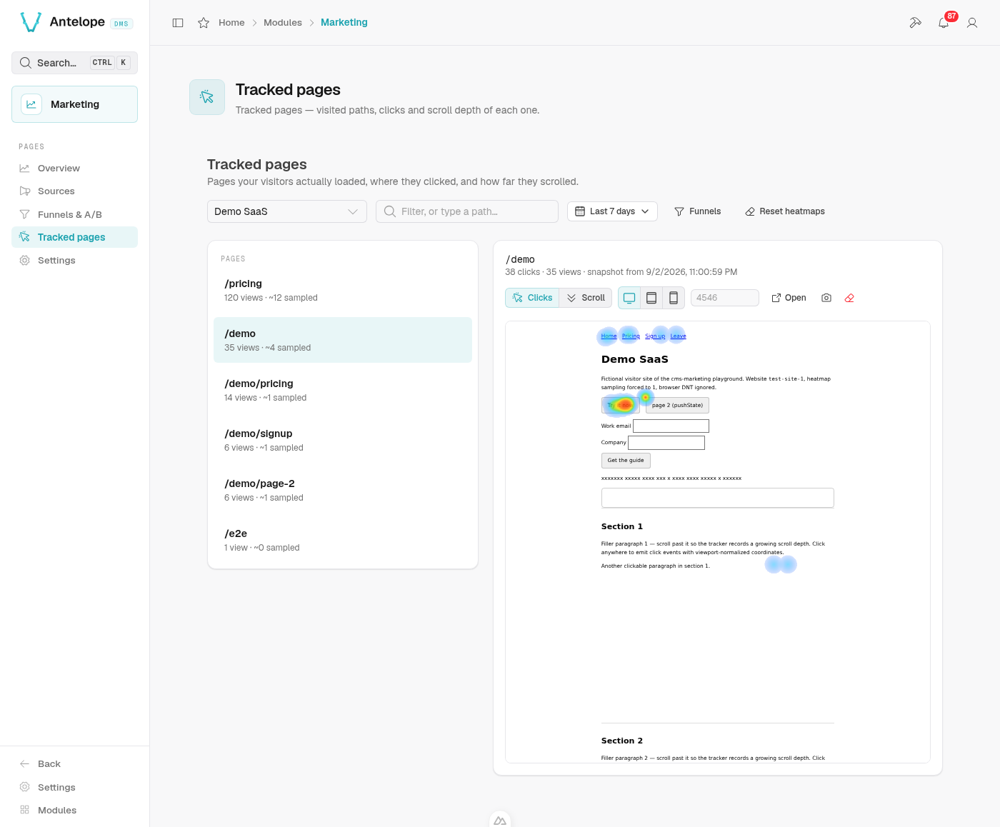

# @antelopejs/dms-marketing

<div align="center">
<a href="./LICENSE"></a>
<a href="https://discord.gg/sjK28QHrA7"></a>
<a href="https://antelopejs.com"></a>
</div>

Marketing analytics module for the AntelopeJS DMS: traffic dashboards,
conversion funnels with optional A/B splits, and click heatmaps — fully
first-party.
No external service, no cookie; data stays in the project's MongoDB.

<p align="center">
  
</p>
<p align="center">
  <em>The Overview page — every panel reads pre-aggregated daily rollups, never raw events.</em>
</p>

## Features

| Feature | Where | Guide |
|---|---|---|
| **Traffic overview** — pageviews, sessions, visitors, top pages/referrers/UTM/browsers, device split; site registration and tracker snippet | `/modules/marketing/overview` | [usage/overview.md](docs/usage/overview.md) |
| **Campaigns & channels** — direct/organic/social/referral/paid split, UTM campaign table (source × medium × campaign) | `/modules/marketing/campaigns` | [usage/campaigns.md](docs/usage/campaigns.md) |
| **Click heatmaps** — clicks drawn over a snapshot of any tracked page | `/modules/marketing/pages` | [usage/heatmap.md](docs/usage/heatmap.md) |
| **Funnels & A/B** — ordered conversion journeys with per-step drop-off, optionally split into server-assigned variations scored with significance | `/modules/marketing/funnels` | [usage/funnels.md](docs/usage/funnels.md) |
| **First-party tracker** — cookieless script, SPA-aware, custom events API | visitor sites | [usage/tracking.md](docs/usage/tracking.md) |
| **Settings** — collection switch, retentions, heatmap sampling | `/modules/marketing/settings` | [usage/settings.md](docs/usage/settings.md) |

<p align="center">
  
</p>
<p align="center">
  <em>Click heatmap over the page itself. Clicks are anchored to the element
  they hit, so they stay on the right button at every viewport width.</em>
</p>

<p align="center">
  
</p>
<p align="center">
  <em>Conversion funnels with per-step drop-off. Computed at read time over
  the period's sessions, so a new definition immediately scores past traffic.</em>
</p>

<p align="center">
  
</p>
<p align="center">
  <em>The same funnel split into A/B arms: one figure per arm, arm against
  arm at every step. Verdicts answer "not enough data" rather than
  overclaim — a sample too thin shows raw counts, never bars.</em>
</p>

## What makes it hold

- **First-party and cookieless.** Visitors are identified by a server-side
  anonymous hash (salted monthly, raw inputs never stored) — the shape
  audience-measurement consent exemptions ask for. Events store no IP, no
  user agent, no headers. Page content is stored in one place only — the
  heatmap's page snapshots — and that is opt-in per site, form values
  always masked, under a short retention of its own.
- **Dashboards never scan raw events.** Statistics are rolled up at write
  time into one bounded row per website-day, counters as native server-side
  increments; raw events are kept short-term only for heatmaps and funnel
  computation.
- **Heatmaps work on any site.** The surface is keyed on the pathnames the
  tracker reports — no route registry, no sitemap, no framework convention —
  clicks are anchored to the element they hit, not to screen coordinates,
  and the backdrop is a snapshot the tracker captured in a visitor's
  browser, so it shows on sites that refuse framing (most of them) and on
  client-rendered ones alike.
- **A/B without an experiment server or a client SDK.** A split is a
  facet of a funnel, not a second object: variations are assigned
  server-side from the same anonymous visitor hash, the page asks with one
  call (`await dmsMarketing.variation("key")`), and the funnel's own steps
  score the arms — z-test verdicts that answer "not enough data" rather
  than overclaim.
- **Tenant isolation is structural.** Analytics tables live in per-tenant
  database instances, the same model as the rest of the DMS — not a filter
  someone can forget.

The reasoning behind each choice is in
[docs/architecture.md](docs/architecture.md).

## Documentation

- **[Installation](docs/install.md)** — DMS side, visitor-site tracker embed,
  development playground.
- **[Usage guides](docs/usage/)** — one per feature, linked in the table above.
- **[Architecture](docs/architecture.md)** — data flow, tenancy, auth model,
  event contract, HTTP surface, heatmap internals, phasing.
- **[Known issues](KNOWN-ISSUES.md)** — one open behavioural defect, found
  end-to-end.

## Status

Pre-release, published on npm as `@antelopejs/dms-marketing`. Audience
measurement, funnels, A/B splits and click heatmaps are functional end-to-end
against the playground; session cohorts and session replay are not built yet.
The full phase plan and current limits are in
[architecture.md](docs/architecture.md#phasing).

## Development

This package is one half of the `dms-marketing` pnpm workspace; run the
commands from the repository root.

```bash
pnpm install --filter @antelopejs/dms-marketing...
pnpm --dir packages/dms-marketing/frontend-vue install
pnpm build      # interface, then tsc
pnpm lint       # oxlint + oxfmt over the backend, eslint over frontend-vue
pnpm typecheck  # tsc over both packages, skipLibCheck off
pnpm knip       # unused dependencies
pnpm test       # backend suite, then the frontend module's vitest suite
```

The admin surfaces ship as a DMS frontend module in `frontend-vue/`: a Vue 3
project whose root `dms.frontend.ts` registers every component under the
`DmsMarketing` prefix, plus its own i18n catalogs. It is a separate project
with a lockfile of its own, published inside this package's tarball and
materialized by the DMS frontend loader (`ajs dms`) into the console's Inertia
workspace. Its own vitest suite runs through `pnpm test`.

The interface this module implements is the workspace's other package,
`packages/interface-dms-marketing`, published under the same `@antelopejs`
scope. This package consumes it through the fleet range
`>=<interface version> <1.0.0`, which pnpm links to the sibling inside the
workspace, so `pnpm build` builds the interface first.
Each is released on its own from GitHub Actions — `release-interface.yml`
then `release.yml`; the module's workflow refuses to run until the interface
version it links is resolvable on npm.

A full consumer project with a tracked demo site lives under `playground/` —
setup in [docs/install.md](docs/install.md#4-development-playground).

## License

Apache-2.0
