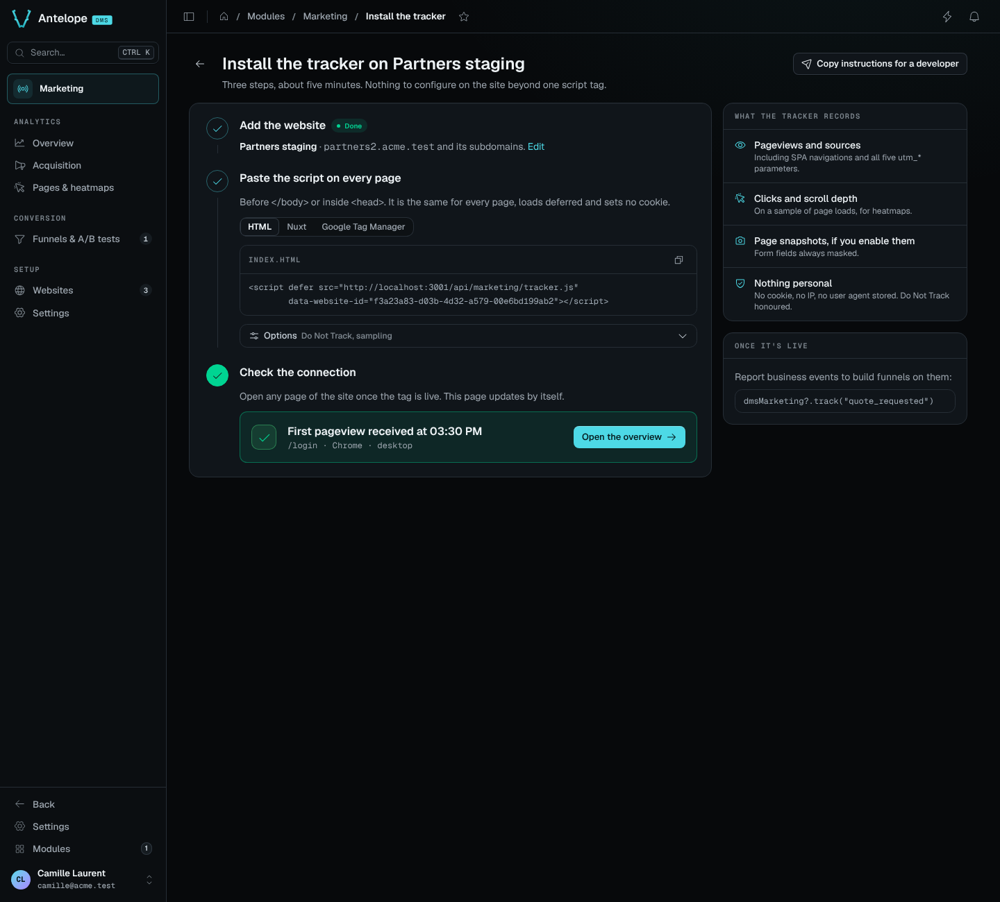
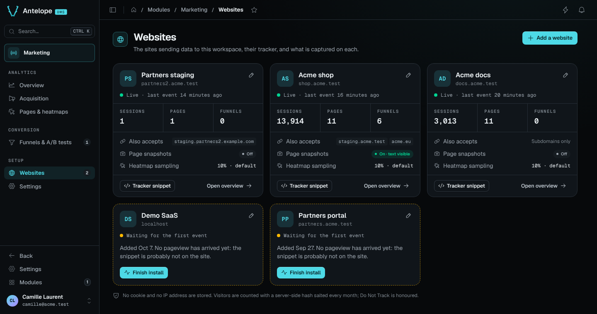

# Installation

Two sides to install: the **DMS project** that hosts the module (backend +
admin pages), and each **visitor-facing site** to be tracked (one `<script>`
tag). A third section covers running the module's own development playground.

> Both packages are published publicly on npm under the `@antelopejs` scope,
> like the DMS itself (`@antelopejs/dms`). No registry configuration or token
> is needed.

## 1. Install in the DMS project

### Requirements

- An AntelopeJS project running the DMS (`@antelopejs/dms` >=0.7.2 <1.0.0,
  which implements `@antelopejs/interface-dms` 0.5) on `@antelopejs/core`
  >=1.13.5, with its usual companions: `@antelopejs/mongodb` ^1.4.2 (earlier
  releases rewrite a stored string starting with `$`, and every i18n key the
  module persists starts with one), `@antelopejs/api`, `@antelopejs/auth-jwt`.
- The DMS console built with `@antelopejs/dms-frontend` >=0.5.2 <0.6.0 —
  the range the frontend module declares in its `engines`.
- MongoDB — analytics data lives in the project's existing database
  deployment, in the DMS `dms-core` / `dms-tenant` schemas.

### Declare the module

Add `dms-marketing` to the project's `antelope.config.ts`:

```ts
export default defineConfig({
  modules: {
    "dms-marketing": {
      source: {
        type: "package",
        package: "@antelopejs/dms-marketing",
        version: "^0.1.0",
      },
      config: {
        // Optional: absolute path of a MaxMind country database (.mmdb).
        // Enables the visitor-country dimension: the collect IP is resolved
        // locally at ingestion and only the country code is stored. The
        // module ships no GeoIP data — supplying the file (GeoLite2 under
        // its EULA, or a commercial db) is the operator's licensing and
        // compliance decision. Replacing the file takes a restart.
        geoipDatabasePath: "/var/lib/geoip/GeoLite2-Country.mmdb",
      },
    },
    // … dms, mongodb, api, auth-jwt as in any DMS project
  },
});
```

### Allow the tracked sites' origins (CORS)

The collect endpoint is called cross-origin from the visitor sites. CORS is
handled by the `@antelopejs/api` module — add each site origin to its config:

```ts
api: {
  config: {
    cors: {
      allowedOrigins: ["https://www.example.com"],
    },
  },
},
```

### Admin frontend

The admin pages are declared backend-side as trees of DMS blocks; the
components the module renders itself ship as a DMS frontend module inside
the package (`frontend-vue/`), a Vue 3 project whose root `dms.frontend.ts`
declares the `DmsMarketing` component prefix and registers them under it.
The module declares that frontend module through `AddFrontendModule`, and the DMS frontend loader
(`@antelopejs/dms-frontend`, CLI `ajs dms`) materializes it into the
generated Inertia workspace: `ajs dms prepare` against a running backend,
`ajs dms dev` to serve the console. Nothing has to be installed alongside
this package — the backend serves the module as an archive. Once up, the
module appears in the sidebar as **Marketing**, its pages under three
headings: **Analytics** (Overview, Acquisition, Pages & heatmaps),
**Conversion** (Funnels & A/B tests) and **Setup** (Websites, Settings). The
funnel report, the funnel builder and the install guide are hidden pages,
reached from the others. The headings do not appear in the URLs: every page
lives at `/modules/marketing/<page>`.

## 2. Register a website

Every tracked site is a *website* row, and its id is what the tracker embeds.
Add it from the console: **Add a website** on the Websites page — or on the
first-run screen every analytics page shows while the workspace has no
website — opens the install guide (`/modules/marketing/install`). Its three
steps create the website from a name and an apex domain, show the tag to
embed with the id filled in, and check the connection (see
[Verify](#verify)).

<p align="center">
  
</p>

The Websites page (`/modules/marketing/websites`) lists the sites
afterwards, one card each: its state (live, waiting for its first pageview,
paused), its sessions, pages and funnels over the last 30 days, the hosts it
accepts, and its snapshot and sampling state. A site still waiting leads
back to its install guide and shows the hosts refused for it; the sidebar
badge on Websites counts those sites. A site's drawer holds three tabs:
**General** (name, domain, extra hosts), **Capture** (page snapshots, mask
all text — a change discards the site's snapshots, and the drawer says how
many) and **Danger zone** (delete the website: it lists what goes — sessions,
rollups, raw events and snapshots; funnel definitions stay — and asks for
the domain).

<p align="center">
  
</p>

The REST API creates the same row with a DMS JWT (tenant owner):

```bash
curl -X POST https://<backend>/api/marketing/websites \
  -H "Authorization: Bearer <jwt>" \
  -H "Content-Type: application/json" \
  -d '{"name": "Main site", "domain": "example.com"}'
```

- `name` — display name in the dashboards.
- `domain` — the site's apex domain, scheme-less. Classifies referrers (an
  internal navigation is never counted as an acquisition source) **and
  gates ingestion**: a beacon is refused unless the browser-reported Origin
  hostname is this domain, a subdomain of it, or one of `extraDomains`.
  Never used to build URLs.
- `extraDomains` — optional; other hosts the site legitimately serves from
  (another TLD, a staging host, localhost), same apex-or-subdomain rule.
- `snapshotsEnabled` — optional, off by default; lets the tracker capture a
  masked rendering of each tracked page as the heatmap's backdrop. This
  stores page content, unlike anything else in the module — read
  [usage/heatmap.md](usage/heatmap.md#page-snapshots) before enabling it.
  Also switchable from the **Capture** tab of the website's drawer and from
  the preview's **More** menu on Pages & heatmaps. `snapshotMaskText` masks
  every text node of the captures on top of the always-masked form values.

The response carries the website's `_id` — the value for `data-website-id`
below, the one the install guide already fills in.

## 3. Install on the visitor site

One tag, before `</body>` or in `<head>`. The install guide gives it in
three forms — plain HTML, a Nuxt `app.head` entry and a Google Tag Manager
custom HTML tag — and **Copy instructions for a developer** copies it with
a short note for whoever edits the site:

```html
<script defer src="https://<backend>/api/marketing/tracker.js"
        data-website-id="<website id>"></script>
```

Optional attributes:

| Attribute | Effect |
|---|---|
| `data-host-url` | override the collect origin (defaults to the script's own origin) |
| `data-heatmap-sample` | 0–1 click/scroll sampling rate for this site; overrides the module setting |
| `data-do-not-track="false"` | ignore the browser DNT signal |

Do **not** load it with `type="module"` — that defeats
`document.currentScript`, and the script cannot find its own attributes.

The tracker is cookieless, batches events, flushes with `sendBeacon`, and
tracks SPA navigations through `history.pushState`/`popstate`. What it
records and the JavaScript API it installs (`window.dmsMarketing.track(…)`)
are covered in [usage/tracking.md](usage/tracking.md). On sites that enable
page snapshots, mark the elements that must never be captured with
`data-dms-marketing-mask` (text masked) or `data-dms-marketing-block`
(replaced by an empty box) — see
[usage/heatmap.md](usage/heatmap.md#what-is-and-is-not-captured).

### Verify

Step 3 of the install guide checks the connection by itself: it polls
`GET /api/marketing/websites/:id/connection` every 4 seconds and turns green
on the first accepted pageview, with its URL, browser and device. A beacon
refused because its host is not declared shows instead as *N events refused
from `<host>`*, with **Allow this host**, which adds the host to the
website's `extraDomains` (`POST /api/marketing/websites/:id/allow-host`).
Refusals are counted in memory, per backend instance, for an hour and for at
most 5 hosts per site: enough for a page that polls while someone installs
the tag, not an audit trail. The Websites page shows the same refused hosts
on a site still waiting for its first pageview.

By hand:

1. Load the site with the browser's network tab open: the tracker script must
   load (a 404 means collection is paused in
   [Settings](usage/settings.md)), then `POST /api/marketing/collect` must
   answer **200** (a **403** means the page's host is not among the
   website's `domain`/`extraDomains`).
2. Within a minute, the page appears on `/modules/marketing/pages`, the
   overview counts the visit and the context bar reads *Live · last event …*
   for the site.

## 4. Development playground

The repository ships a full consumer project under
`packages/dms-marketing/playground/`: backend on
`:5010`, DMS console via `ajs dms dev`, and a demo site under
`http://localhost:5010/demo` — a small tracked multi-page site (pricing,
signup, SPA navigation, custom events, a prefilled form and masked elements)
that exercises every capture path with `data-heatmap-sample="1"` so nothing
is left to sampling. Its pages refuse framing (`X-Frame-Options: DENY`),
as production sites do, so the heatmap backdrop is exercised the way real
sites exercise it: through page snapshots, enabled on the seeded website.

```bash
pnpm install --filter @antelopejs/dms-marketing...   # workspace root
pnpm build                       # interface, then tsc → dist/
cd packages/dms-marketing/playground
pnpm install --ignore-workspace  # its own lockfile, not the workspace
pnpm dev                         # backend on :5010 (ajs project run -w)
pnpm frontend:dev                # DMS console (ajs dms dev)
```

> **Do not bump `zod` past `~3.24.x`** (pinned in `package.json`). The DMS's
> shared types — data-api column
> schemas, declarative forms — are built against zod 3.24, and 3.25 changes
> the internal type structure they rely on: a routine bump typechecks this
> module in isolation and breaks it against the DMS. The tilde range is
> deliberate; it can only move when `@antelopejs/dms` moves first.

The playground expects a local MongoDB on `mongodb://localhost:27017`
(database `playground-dms-marketing`), overridable through the `MONGO_URL`
environment variable (`MONGO_URL=mongodb://127.0.0.1:27117 pnpm dev`), and
declares CORS for the dev console on port 3001 (plus `DMS_CLIENT_BASE_URL`
when set). It loads the DMS, its storage and mail companions and this
module, not `@antelopejs/dms-api`, whose frontend does not run on
`@antelopejs/dms-frontend` 0.5 yet.

The demo site's website row is seeded by the playground itself at first
start (`playground/src/seed.ts` in that project), since the demo pages embed
a fixed `data-website-id`. Once, at first start, the playground also seeds a
demo dataset (`playground/src/demo-data.ts`) so every page has something to
show: three websites of the default tenant — a busy shop, a quieter docs
site and one still waiting for its first pageview — with 120 days of daily
rollups, 30 days of raw events behind funnels, an A/B test and a heatmap,
and a page snapshot to draw it on. Start with `DMS_MARKETING_DEMO=0` to skip
it. Funnels over the demo site's own journey are ordinary definitions to
create from the console: `/demo` → `/demo/pricing` → `/demo/signup` → custom
`signup_submitted`.

Lint with `pnpm lint`: oxlint and oxfmt over the backend, then eslint over
`frontend-vue/` (`pnpm --dir packages/dms-marketing/frontend-vue install`
first — the frontend module has a lockfile of its own). `pnpm typecheck`
runs `tsc` over both packages and `pnpm knip` reports unused dependencies;
CI gates on all three. `pnpm test` runs the
backend suite and the frontend module's vitest suite.
