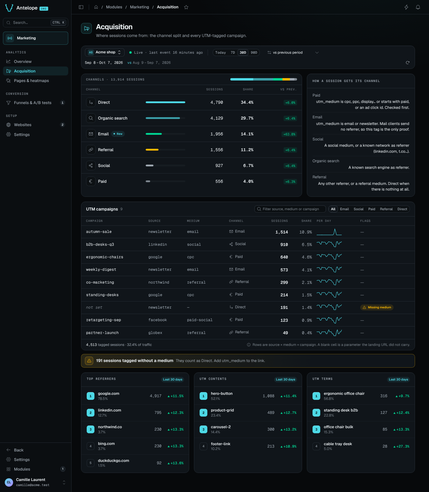

# Acquisition

**Where:** `/modules/marketing/acquisition` — under **Analytics**, right
after the overview.

The overview says how much traffic came; this page says where it came from:
the six-channel split of sessions, the UTM campaign table, and the referrer
and UTM details behind them. It reads the website and period of the
[context bar](overview.md#the-context-bar).

  

## What it shows

- **Channels** — sessions grouped as **direct / organic / social / email /
  referral / paid**, each with its share and its change against the
  comparison window. Every channel is listed, even at zero. The channel is
  not something the tracker sends: it is a pure mapping of the session's
  referrer domain, `utm_medium` and ad click id, applied when the session is
  counted (see below). Beside the card, **How a session gets its channel**
  states the rules.
- **UTM campaigns table** — one row per **(source, medium, campaign)**
  triple observed on new sessions, ranked by sessions, with its share of the
  period's sessions, a sessions-per-day sparkline and the channel its medium
  maps to. A blank cell is a UTM parameter the landing URL did not carry —
  `?utm_source=newsletter` alone is a real campaign row with an empty medium
  and campaign. The filter matches across the three columns, and asks the
  route itself once the table is cut at its top 100 rows; the tabs
  narrow the table to one channel. The card's header gives the
  tagged sessions and their share of all traffic.
- **Missing medium** — a row tagged without `utm_medium` is flagged, and a
  banner above the table counts its sessions: with no medium they classify
  by referrer alone, which makes them Direct when the link carried no
  referrer — a mail client never sends one. Adding `utm_medium` to the link
  fixes it for the sessions to come.
- **Top referrers / UTM contents / UTM terms** — the external referrer
  domains counted on new sessions (all channels, not just the referral
  slice), plus `utm_content` and `utm_term`, the two parameters that do not
  take part in the triple, as top lists.

## How channels are classified

Applied in order; the first match wins:

| Channel | Matches |
|---|---|
| **paid** | `utm_medium` in cpc, ppc, cpm, cpv, cpa, cpp, sem, display, banner, retargeting — or starting with `paid` (`paid-social`, `paid_search`…) — or an ad click id on the landing URL (`gclid`, `gbraid`, `wbraid`, `dclid`, `msclkid`, `ttclid`, `twclid`, `li_fat_id`) |
| **email** | `utm_medium` in email, e-mail, e_mail, newsletter, mail |
| **social** | `utm_medium` spelling out social, the referrer being a known social network (facebook, instagram, x/twitter, linkedin, reddit, tiktok, youtube… including shorteners like `t.co`), or a `fbclid`/`igshid` click id |
| **organic** | `utm_medium=organic`, or the referrer being a known search engine (google, bing, duckduckgo, yahoo, baidu, yandex…) |
| **referral** | any other external referrer, or `utm_medium` in referral, affiliate, partner — with or without a referrer |
| **direct** | no referrer, nothing matched |

Paid is checked first on purpose: an ad click keeps its `google.com` or
`facebook.com` referrer and would otherwise read as organic or social.
Email comes next, on its medium alone: a desktop mail client sends no
referrer and a webmail sends its own host, so without the tag the session
would read as direct or referral. A medium the mapping does not know keeps
referrer semantics — referral with a referrer, direct without one.

The mapping runs when the session's rollup fires, and the channel is stored
nowhere else — so refining the mapping needs no migration, but it never
reclassifies the past either: sessions already rolled up keep the channel
they got, and only sessions counted after the change classify by the new
rules. Email and the referral mediums arrived that way; days rolled up
before them count those sessions as direct or referral.

## Where the numbers come from

Same source as the overview — the **daily rollups**, never raw events — so
the same caveats apply ([overview.md](overview.md#where-the-numbers-come-from)):

- A day keeps at most `MAX_ENTRIES_PER_TOP_MAP` (50) campaign triples;
  long-tail campaigns on high-cardinality days are approximate. The table
  holds the top 100 rows of the period and says when more combinations were
  seen; a filter then searches every combination through the route's
  `search=` parameter, which filters before that cut.
- **Dimensions start at their ship date.** Days rolled up before the
  campaign and channel dimensions existed contribute nothing to this page;
  a window overlapping that boundary undercounts campaigns, never traffic.
- Sessions carrying no UTM at all appear in the channels card (as direct,
  organic, social or referral) but never in the campaigns table.
