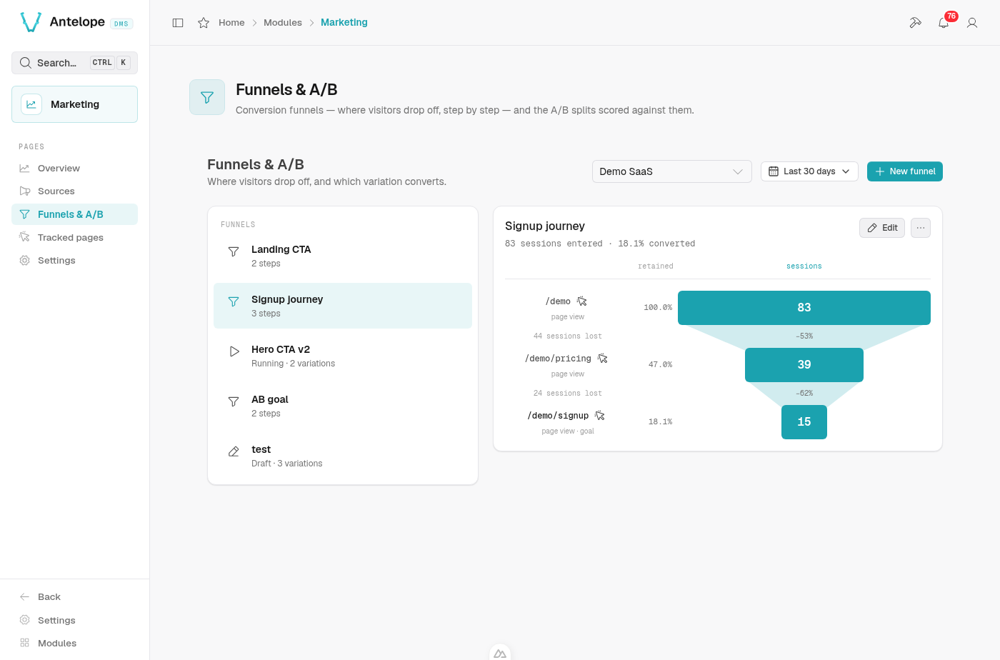
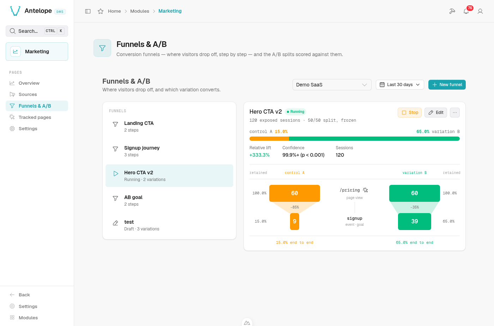

# Funnels & A/B

**Where:** `/modules/marketing/funnels`.

A funnel is an ordered conversion journey — "landed on `/pricing`, then
submitted the signup form" — measured over the sessions of a period. The
page pairs the funnel list (create, edit, delete) with the figure of the
selected funnel. A funnel can also be **split** into A/B variations: the
backend then assigns every visitor an arm, the page applies it, and the same
figure is drawn once per arm, under a significance verdict.

<p align="center">
  
</p>

## Defining a funnel

- **Steps** — 1 to 10, each either a **page URL** (a path the visitor must
  view) or a **custom event** (a name reported through
  `window.dmsMarketing.track(...)` — see [tracking.md](tracking.md)). A
  single step is a conversion counter on its own.
- **Conversion window** — how long a session has to complete the journey
  after entering step 1. Default 24 h, maximum 720 h (30 days).
- **Website** — a funnel belongs to one website.
- **A/B split** — off by default; see [below](#splitting-a-funnel-into-ab-variations).

Steps are matched **in order within a session**: a session counts for step N
only if it already matched steps 1…N-1, earlier in time.

## Reading a plain funnel

The funnel is drawn top to bottom, one centred bar per step: the bar carries
the number of sessions that reached that step, its share of the entering
sessions reads beside it, and the taper down to the next bar carries the
drop-off — in percent inside the taper, in sessions under the step. Results
are computed at read time over the raw events of the selected period
(bounded at `MAX_FUNNEL_EVENTS` = 200 000 events per computation, past which
a **Window truncated** warning says the numbers cover the oldest part of the
period only), so a new funnel definition immediately shows results for past
traffic — no waiting for data to accumulate. The flip side: the period
cannot reach past the raw events retention (90 days by default).

## Splitting a funnel into A/B variations

Turn on **Split traffic between variations** in the funnel form. The split
is a **key** (the slug page code asks for) and 2–8 **variations**
`{key, weight}` — weights are relative and normalized, the **first variation
is the control**. The funnel's own steps are the goal every arm is scored
against; nothing else needs to exist anywhere.

<p align="center">
  
</p>

```
marketing_funnels ──► GET /api/marketing/experiments.js?website=<id>
   (split running)                  │  (public, per-visitor, no-store)
                                    ▼
                      await dmsMarketing.variation("hero-cta")
                                    │  page applies the arm
                                    ▼
                      `exposure` events through collect
                                    │
                                    ▼
                      Funnels page: the figure per arm + z-test
```

The lifecycle is `draft → running ⇄ stopped`, driven by the **Start**,
**Stop** and **Resume** buttons of the detail pane. Nothing ever returns to
draft. Only `running` splits are served to visitors, and the key and
variations **freeze once the split leaves draft**: moving weights mid-run
would shift the deterministic buckets and silently reassign visitors. The
name, the steps and the window **stay editable at any status** — results are
computed read-time, so a step change re-scores past traffic immediately and
never touches assignment. The split itself can only be removed while it is a
draft; a stopped one keeps its results readable until the funnel is deleted,
which is allowed at any status — pages fall back to the control within the
definitions cache TTL (30 s).

**Stopping ends the measurement, not just the assignment.** From the stop
on, the endpoint serves no assignment for the key — every visitor falls back
to the control within the definitions TTL (30 s), pages already open at their
next reload — collect refuses exposures for it, and the results are read over
the runs that closed, so the numbers of a stopped split are final. The reverse holds at the other end: a draft
has no results at all, only the plain funnel underneath it. Sessions exposed
shortly before the stop keep the funnel's whole conversion window to reach
the goal, and those late conversions still count.

**Resuming picks up where the stop left off.** The arms and their weights are
frozen, so the same visitor lands on the same arm as before and the sessions
already exposed stay in the counts: the split simply gains a second run, and
the pause between the two counts for nothing — no assignment, no exposure,
and the pane says how many runs it is reading (*run 12 Aug – 30 Aug
(2 runs)*). Resume when the stop was accidental or too early. Do not resume
because the verdict was not the one you hoped for: stopping on a p-value and
gathering more until it moves is optional stopping, and it inflates the
false-positive rate well past the 95% the verdict claims. To test a changed
hypothesis — other arms, other weights — create a new split instead.

While the split is a draft, the pane still reads as the plain funnel — the
baseline the arms will be compared to.

### Client-site integration

One call, where the variation is applied:

```js
const arm = await window.dmsMarketing?.variation("hero-cta");
if (arm === "b") {
  showAlternateHero();
}
```

- **Assignment is server-side and deterministic** —
  `sha256(visitorId : experiment key)` against the normalized weights. The
  same visitor keeps the same arm for the whole month (the identity salt
  rotates monthly, see
  [architecture.md](../architecture.md#anonymous-identity)); nothing is
  stored on the visitor's device.
- **`null` means render the control** — key unknown or not running,
  collection disabled, DNT. Treat every non-matching answer as
  the control and the page degrades safely.
- **The exposure is reported by the call itself**, once per page load, and
  only for the keys the page consulted: a split fetched but never asked for
  does not count anyone as exposed.
- **Browser-side only.** The assignment derives from the *visitor's own
  request* (IP + user agent). Fetching it at SSR time would put every
  visitor behind the renderer's single identity — one arm for everyone. If
  you must assign server-side, run your own split and report it with
  `dmsMarketing.exposure(experiment, variation)` — which the backend accepts
  only while the split is running, exactly like the assignment it replaces.

### Reading the results

Select the funnel — results are read against its own steps, nothing else to
pick. The computation is read-time over the raw event window, so editing the
steps immediately re-scores past traffic.

The window is the **split's own runs**, not the period selected at the top of
the module: the line under the title says which (*running since 12 Aug*,
*run 12 Aug – 30 Aug*, plus the run count once there is more than one). An
A/B reading is the whole sample gathered since the start — cutting it to the
last 7 days would answer a different question, and a stopped split would keep
changing as the period slides past it. The period picker still drives every
other page, and the plain funnel of a split still in draft.

The read is the funnel drawn once per arm, so the arms compare at every step
of the way and not only at the goal. Two arms mirror around the step they
share — control on the left, challenger on the right; more arms line up as
columns. Every bar is a share of that arm's **exposed sessions**, not of
funnel entries (entering the funnel is itself an outcome the variation
influences); that share is printed as *retained* beside each bar, the taper
down to the next bar carries what the step costs the arm, and an end-to-end
line closes each column.

Above the funnel sits the verdict: the goal as one two-tone bar, control
against the best-converting challenger, with the relative uplift, the
confidence (two-sided z-test at 95%) and the sessions behind it. Past one
challenger the banner still judges only the best arm, so every other one
keeps its own uplift and verdict line under the funnel.

The verdict is withheld — never guessed — when the sample is too thin or the
event window was truncated. When *no* arm reaches a verdict on a healthy
window, the bars are withheld with it: the page shows raw counts (exposed,
reached the goal) per arm instead of rates that would dress noise as signal.

Two warnings can appear above the numbers:

- **Sample ratio mismatch (SRM)** — the observed split across arms is too
  far from the configured weights (chi-square, p < 0.001). Assignment or
  exposure reporting is broken somewhere; distrust the numbers.
- **Window truncated** — the raw-event window hit its cap
  (`MAX_FUNNEL_EVENTS`); numbers cover the oldest part of the period only.

### What to know before trusting a reading

- **The unit is the session.** A visitor exposed in one session and
  converting in the next without re-exposure does not count. Sessions
  exposed to two arms of the same split (salt rotation mid-session) are
  excluded entirely.
- **Results live as long as raw events.** Exposures and conversions share
  the raw-event retention; past it, both sides of the ratio fade together —
  including the final reading of a stopped split, which is why a finished
  test worth keeping is worth exporting.
- **One month is the natural horizon.** On the 1st the identity salt
  rotates and visitors re-draw their arm; the per-session unit keeps the
  statistics valid, but a months-long split mixes populations.
- **Multiple comparisons are not corrected.** With several arms tested
  against the control at 95%, the family-wise false-positive rate is higher
  than 5%.

## Known quirk

Creating a funnel currently shows an error toast right next to the success
toast; the row is saved correctly. The bug lives in the DMS core form
handling, not in the funnel — see [KNOWN-ISSUES.md](../../KNOWN-ISSUES.md),
issue 1.
