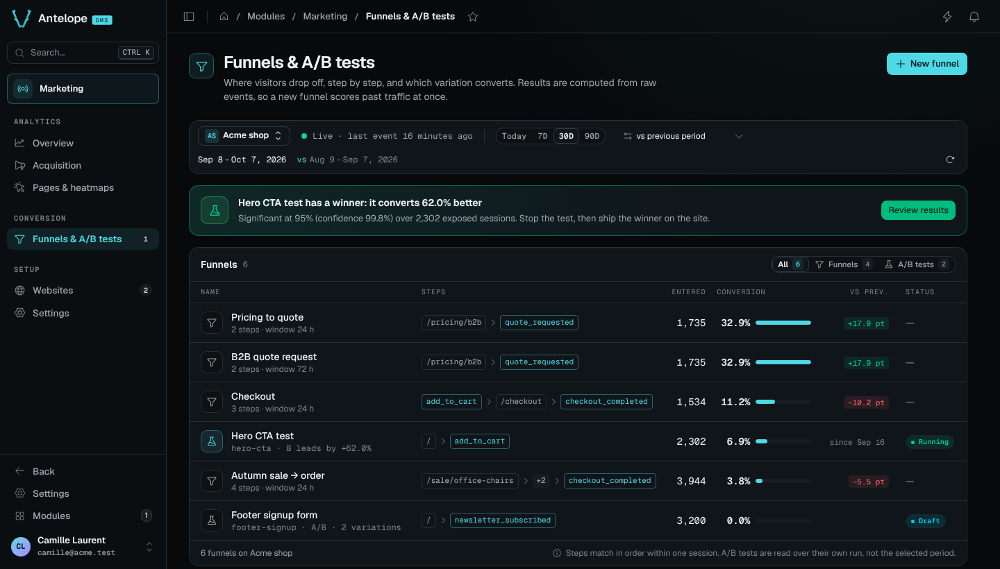
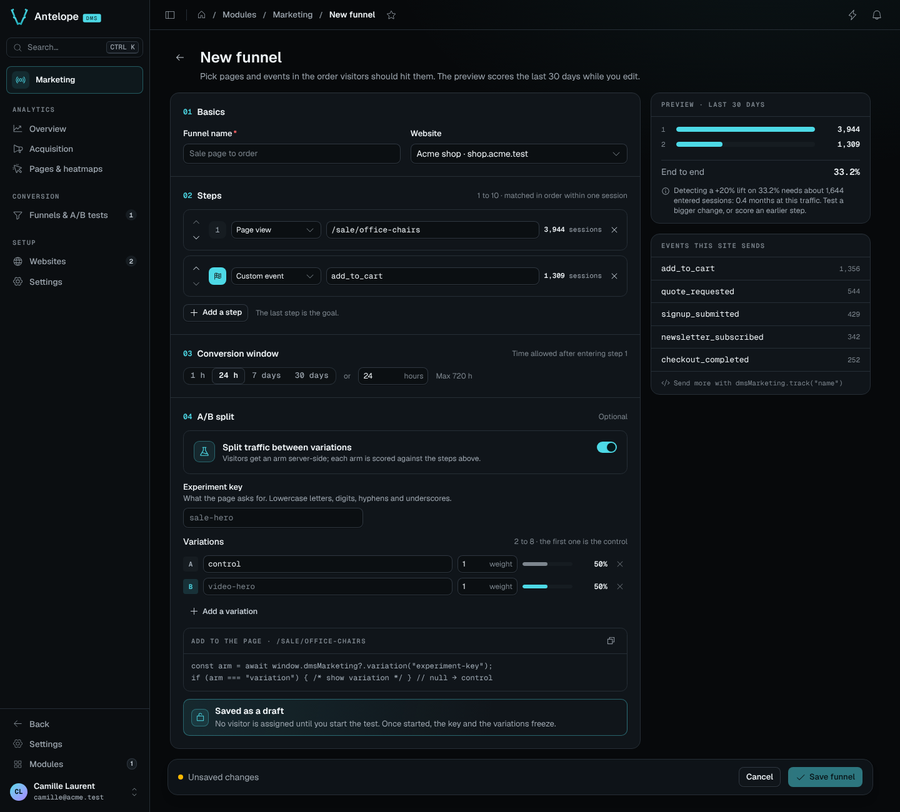
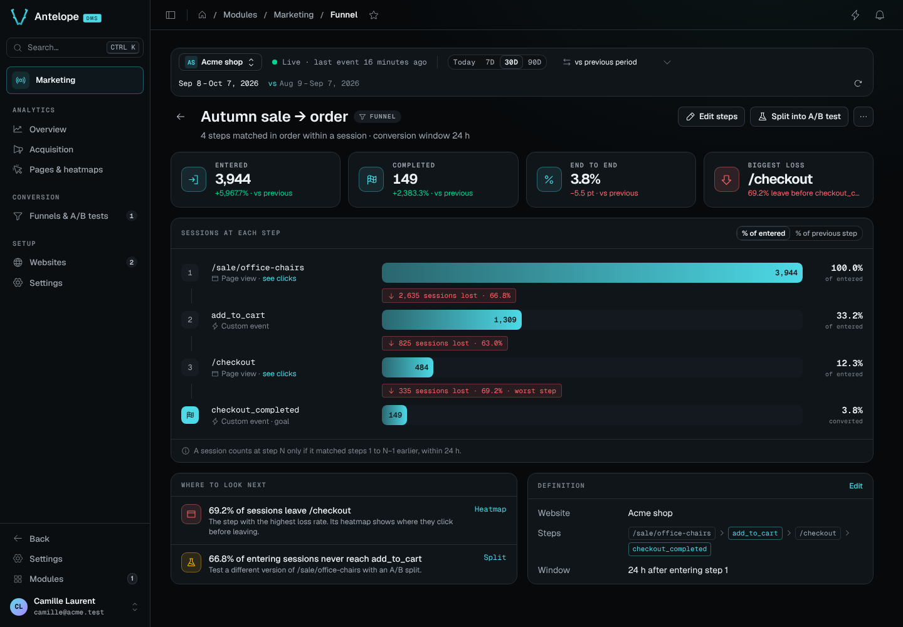
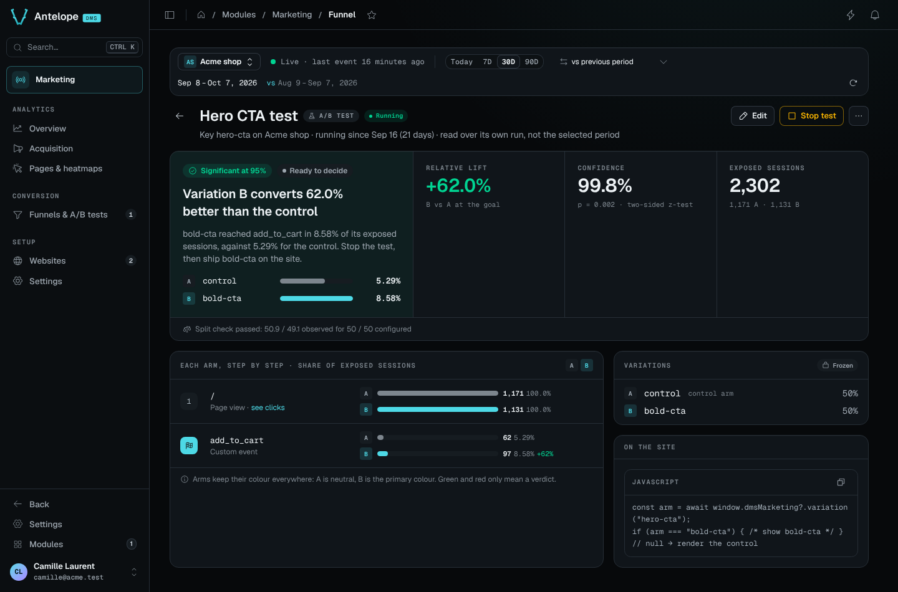

# Funnels & A/B tests

**Where:** `/modules/marketing/funnels` — under **Conversion**. Each funnel
opens on its report page (`/modules/marketing/funnel?id=<funnel id>`), and
the builder (`/modules/marketing/funnel-builder`) creates and edits them.

A funnel is an ordered conversion journey — "landed on `/pricing`, then
submitted the signup form" — measured over the sessions of a period. A
funnel can also be **split** into A/B variations: the backend then assigns
every visitor an arm, the page applies it, and the funnel is read once per
arm, under a significance verdict.

<p align="center">
  
</p>

## The funnels list

One row per funnel of the website picked in the
[context bar](overview.md#the-context-bar): its steps, the sessions that
entered it, its end-to-end conversion as a bar, the change of that
conversion against the comparison window (in points, plain funnels only),
and its status — the A/B split's state and leader, when it has one. The tabs
narrow the table to **Funnels** or **A/B tests**. When a running test has
reached significance, a banner above the table names it and leads to its
report. The sidebar badge on the page counts the running A/B tests.

A website without any funnel shows templates instead, built from its own
most visited pages and most frequent custom events, each with the number of
sessions that would enter it; one click opens the builder prefilled with its
steps (`?steps=`), or **Start from scratch** opens it empty.

## Defining a funnel

**New funnel** in the page header opens the builder; **Edit** on a report
opens it on that funnel (`?id=`).

<p align="center">
  
</p>

- **Steps** — 1 to 10, each either a **page URL** (a path the visitor must
  view) or a **custom event** (a name reported through
  `window.dmsMarketing.track(...)` — see [tracking.md](tracking.md)). The
  fields autocomplete from the site's tracked pages and custom events, with
  their views or triggers. A single step is a conversion counter on its own;
  the last step is the goal.
- **Conversion window** — how long a session has to complete the journey
  after entering step 1: 1 h, 24 h, 7 days, 30 days, or any number of hours.
  Default 24 h, maximum 720 h (30 days).
- **Website** — a funnel belongs to one website.
- **A/B split** — off by default; see [below](#splitting-a-funnel-into-ab-variations).

While you edit, the **preview** scores the definition over the last 30 days
(`POST /api/marketing/funnels/preview`, nothing saved): sessions at each step
and end to end.

Steps are matched **in order within a session**: a session counts for step N
only if it already matched steps 1…N-1, earlier in time.

## Reading a plain funnel

<p align="center">
  
</p>

The report page opens on four figures: sessions **entered**, sessions
**completed** and the **end-to-end** conversion, each with its change
against the comparison window (end to end in points), and the **biggest
loss** — the step with the highest loss rate. Below them, one bar per step
carries the sessions that reached it, read as **% of entered** or **% of
previous step** (a toggle), with the sessions lost before the next step; the
biggest loss is flagged **worst step**. **Where to look next** names that
step, with a link to its heatmap when it is a page, and the share of
sessions that never reach step 2, with a link that opens the builder to
split the funnel into an A/B test. **Definition** restates the steps, the
window and the website.

Results are computed at read time over the raw events of the selected period
(bounded at `MAX_FUNNEL_EVENTS` = 200 000 events per computation, past which
a **Window truncated** warning says the numbers cover the oldest part of the
period only), so a new funnel definition immediately shows results for past
traffic — no waiting for data to accumulate. The flip side: the period
cannot reach past the raw events retention (90 days by default).

## Splitting a funnel into A/B variations

Turn on **Split traffic between variations** in the builder (or **Split
into A/B test** on a report, which opens the builder with it on,
`?split=1`). The split is a **key** (the slug page code asks for) and 2–8
**variations** `{key, weight}` — weights are relative and normalized, and
the builder shows each as its share of traffic; the **first variation is the
control**. The funnel's own steps are the goal every arm is scored against;
nothing else needs to exist anywhere. The builder also shows the
`variation()` snippet for the key, and a sample-size hint: how many entered
sessions detecting a +20% relative lift at the preview's conversion rate
would take (two-proportion test, 95% confidence, 80% power), and how many
months that is at the site's current traffic.

```
marketing_funnels ──► GET /api/marketing/experiments.js?website=<id>
   (split running)                  │  (public, per-visitor, no-store)
                                    ▼
                      await dmsMarketing.variation("hero-cta")
                                    │  page applies the arm
                                    ▼
                      `exposure` events through collect
                                    │
                                    ▼
                      A/B report: each arm step by step + z-test
```

The lifecycle is `draft → running ⇄ stopped`, driven by the **Start test**,
**Stop test** and **Resume test** buttons of the report page, each behind a
confirmation: Start lists what freezes (the key and the variations with
their shares) and reminds that the page must call `variation()`; Stop says
every visitor gets the control again. Nothing ever returns to
draft. Only `running` splits are served to visitors, and the key and
variations **freeze once the split leaves draft**: moving weights mid-run
would shift the deterministic buckets and silently reassign visitors. The
name, the steps and the window **stay editable at any status** — results are
computed read-time, so a step change re-scores past traffic immediately and
never touches assignment. The split itself can only be removed while it is a
draft; a stopped one keeps its results readable until the funnel is deleted,
which is allowed at any status — pages fall back to the control within the
definitions cache TTL (30 s).

**Stopping ends the measurement, not just the assignment.** From the stop
on, the endpoint serves no assignment for the key — every visitor falls back
to the control within the definitions TTL (30 s), pages already open at their
next reload — collect refuses exposures for it, and the results are read over
the runs that closed, so the numbers of a stopped split are final. The reverse holds at the other end: a draft
has no results at all, only the plain funnel underneath it. Sessions exposed
shortly before the stop keep the funnel's whole conversion window to reach
the goal, and those late conversions still count.

**Resuming picks up where the stop left off.** The arms and their weights are
frozen, so the same visitor lands on the same arm as before and the sessions
already exposed stay in the counts: the split simply gains a second run, and
the pause between the two counts for nothing — no assignment, no exposure.
Resume when the stop was accidental or too early. Do not resume
because the verdict was not the one you hoped for: stopping on a p-value and
gathering more until it moves is optional stopping, and it inflates the
false-positive rate well past the 95% the verdict claims. To test a changed
hypothesis — other arms, other weights — create a new split instead.

While the split is a draft, the report still reads as the plain funnel —
the baseline the arms will be compared to — under a *Saved as a draft*
notice.

### Client-site integration

One call, where the variation is applied:

```js
const arm = await window.dmsMarketing?.variation("hero-cta");
if (arm === "b") {
  showAlternateHero();
}
```

- **Assignment is server-side and deterministic** —
  `sha256(visitorId : experiment key)` against the normalized weights. The
  same visitor keeps the same arm for the whole month (the identity salt
  rotates monthly, see
  [architecture.md](../architecture.md#anonymous-identity)); nothing is
  stored on the visitor's device.
- **`null` means render the control** — key unknown or not running,
  collection disabled, DNT. Treat every non-matching answer as
  the control and the page degrades safely.
- **The exposure is reported by the call itself**, once per page load, and
  only for the keys the page consulted: a split fetched but never asked for
  does not count anyone as exposed.
- **Browser-side only.** The assignment derives from the *visitor's own
  request* (IP + user agent). Fetching it at SSR time would put every
  visitor behind the renderer's single identity — one arm for everyone. If
  you must assign server-side, run your own split and report it with
  `dmsMarketing.exposure(experiment, variation)` — which the backend accepts
  only while the split is running, exactly like the assignment it replaces.

### Reading the results

<p align="center">
  
</p>

Open the funnel's report — once its split has started, the report is the
A/B test's. Results are read against the funnel's own steps, nothing else to
pick. The computation is read-time over the raw event window, so editing the
steps immediately re-scores past traffic.

The window is the **split's own runs**, not the period of the context bar:
the line under the title says which (*running since 12 Aug (20 days)*, *ran
12 Aug – 30 Aug*). An A/B reading is the whole sample gathered since the
start — cutting it to the last 7 days would answer a different question, and
a stopped split would keep changing as the period slides past it. The period
still drives every other page, and the plain funnel of a split still in
draft.

The report opens on the verdict, as a sentence with its next action —
*Variation B converts 12% better than the control … Stop the test, then ship
b on the site* — and beside it the **relative lift** of the best-converting
challenger at the goal, the **confidence** (1 − p of a two-sided z-test,
significant at 95%) and the **exposed sessions**. Past one challenger the
verdict judges only the best arm; every arm keeps its own figures below.

Then each arm, step by step, so the arms compare at every step of the way
and not only at the goal. Every figure is a share of that arm's **exposed
sessions**, not of funnel entries (entering the funnel is itself an outcome
the variation influences). Arms keep an identity colour everywhere — A
neutral, B the primary colour, then other tones — and green and red only
ever mean a verdict. The report closes on the frozen variations and their
weights, and the snippet the page calls.

The verdict is withheld — never guessed — when the sample is too thin, the
split check failed or the event window was truncated. When *no* challenger
reaches a verdict on a healthy window, the rates are withheld with it: a
*Too few conversions to compare the arms* card gives raw counts (exposed,
reached the goal) per arm instead, until every arm has at least 5
conversions.

Two warnings can appear above the numbers; a passing split check also shows
as one line (*Split check passed*):

- **Sample ratio mismatch (SRM)** — the observed split across arms is too
  far from the configured weights (chi-square, p < 0.001). Assignment or
  exposure reporting is broken somewhere; distrust the numbers.
- **Window truncated** — the raw-event window hit its cap
  (`MAX_FUNNEL_EVENTS`); numbers cover the oldest part of the period only.

### What to know before trusting a reading

- **The unit is the session.** A visitor exposed in one session and
  converting in the next without re-exposure does not count. Sessions
  exposed to two arms of the same split (salt rotation mid-session) are
  excluded entirely.
- **Results live as long as raw events.** Exposures and conversions share
  the raw-event retention; past it, both sides of the ratio fade together —
  including the final reading of a stopped split, which is why a finished
  test worth keeping is worth exporting.
- **One month is the natural horizon.** On the 1st the identity salt
  rotates and visitors re-draw their arm; the per-session unit keeps the
  statistics valid, but a months-long split mixes populations.
- **Multiple comparisons are not corrected.** With several arms tested
  against the control at 95%, the family-wise false-positive rate is higher
  than 5%.

## Deleting a funnel

**Delete funnel…** on the report page asks for the funnel's name. The
definition goes, its A/B split with it; the collected events stay. Pages
asking for a deleted split's key fall back to the control within the
definitions cache TTL (30 s).
