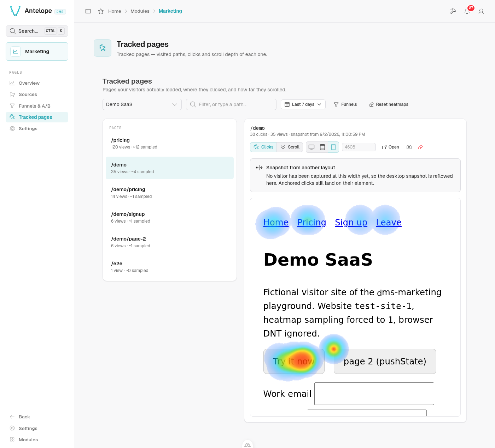
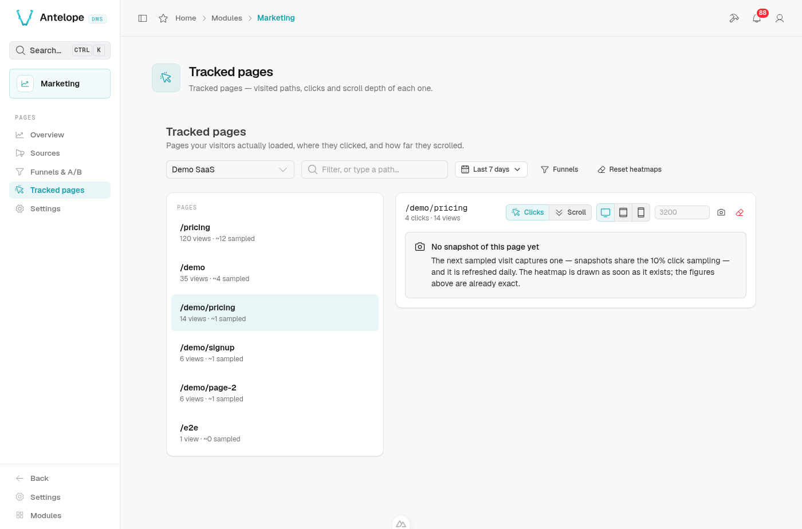
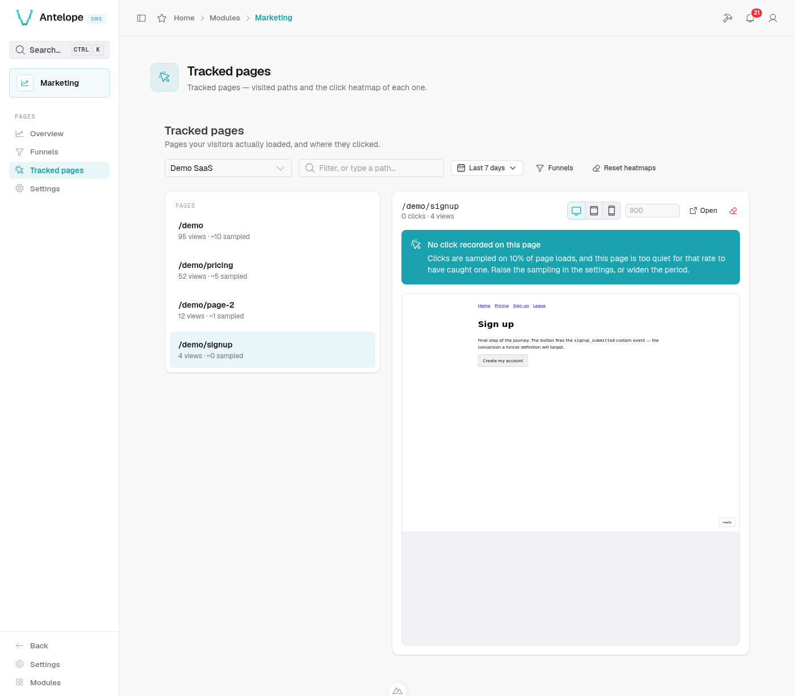

# Tracked pages & heatmaps

**Where:** `/modules/marketing/pages`.

The page has two panes: on the left, the inventory of paths the tracker has
reported for the selected website; on the right, the clicks and scroll depth
of the selected path, drawn over a snapshot of the page. The toolbar
switches the overlay between **Clicks** and **Scroll** above the same
backdrop.

  

The surface is keyed on nothing but a website id and a bare pathname the
tracker itself reported — no route registry, no sitemap, no build manifest, no
framework convention — which is what makes it hold for a tracked site built
any way at all.

## Reading a heatmap

1. Pick a **website**, a **period**, then a **path** in the inventory.
2. The right pane renders the page's snapshot (see *Page snapshots* below)
   and draws the recorded clicks over it.

State lives in the URL, so a heatmap can be linked to.

### Clicks stick to elements, not to screen positions

Each click stores *which element it hit and where inside it* (a short CSS
selector plus a 0–1 offset in the element's box), on top of plain document
coordinates. The overlay projects from the element anchor whenever it can
resolve it in the snapshot. The practical effect: clicks recorded through
desktop windows still land on the right button when you view the page at
mobile width, even though the layout moved everything around.

  

  <em>The same clicks in the 390&nbsp;px layout. They were captured through
  wider windows, and they still land on the button — that is anchoring.</em>

Every way anchoring can fail (no snapshot yet, element gone, selector now
ambiguous) falls back to document fractions — which is also all that clicks
captured before anchoring ever had, so those render approximately. The
mechanism is detailed in [architecture.md](../architecture.md#heatmap-anchoring).

## Scroll depth

The **Scroll** overlay shades the page by how many of the measured views saw
each band — warm at the top, cold where almost nobody went — with labelled
lines at fixed shares (*"50% of visitors see down to here"*) and a readout
following the pointer.

Three things to keep in mind when reading it:

- **Shares are "of the views that scrolled".** The tracker records the max
  depth reached per sampled page load and emits nothing when the visitor
  never scrolls — including on every page that fits the screen. The header
  states that denominator ("N scrolled views") next to the pageview count.
- **Depth is a fraction of the visitor's scrollable range**, measured through
  windows this dashboard cannot know. The overlay anchors depth 0 at the
  bottom of the first screen (the viewport the snapshot was captured in) and
  100 at the bottom of the page: read bands and lines, not pixels.
- **Same sampling, same window as clicks** — one draw per page load decides
  both, and both read the raw events retention.

Resetting a heatmap deletes clicks, scroll depths and snapshots together.

## Page snapshots

The backdrop is not the live site in a frame: it is a **snapshot** of the
page, captured in a visitor's browser by the tracker and replayed here.
Framing the live site was abandoned because most production sites refuse
it — `X-Frame-Options` or a CSP `frame-ancestors`, which Nginx, Cloudflare,
Helmet and framework templates set by default — and a refused frame gives
the console no signal at all: a blank panel and a guess.

How a snapshot comes to exist:

1. **Opt-in, per website.** Snapshots store page content, which nothing else
   in the module does. They are off until the site enables them: the banner
   on Tracked pages carries the switch, and the camera button in the toolbar
   holds both options (snapshots on/off, mask all text). Over the API the
   fields are `snapshotsEnabled` and `snapshotMaskText` on the website
   (`PUT /api/marketing/websites/:id`).
2. **Negotiated capture.** On a visit already sampled for clicks (the same
   draw, 10 % by default), once the page has loaded and gone idle, the
   tracker asks the backend whether a capture of this path at this layout
   is wanted. It is when none exists or the existing one is older than a
   day; the answer is then the capture script itself, otherwise nothing. So
   the first sampled visit of a page captures it, a page is captured about
   once a day however busy it is, and no visit uploads a capture that would
   be discarded.
3. **Serialization in the visitor's browser.** The rendered DOM — what the
   visitor sees, whatever built it, client-rendered SPAs included — is
   serialized into one self-contained HTML document: same-origin stylesheets
   inlined from the CSSOM (CSS-in-JS included), URLs made absolute,
   cross-origin stylesheets left as links, open shadow roots emitted as
   declarative shadow DOM. Captured after the DOM has gone quiet and in idle
   time, so the visitor's page never waits for it.
4. **Replay.** The console renders the document in a sandboxed frame: no
   script runs in it, nothing in it can be clicked, hovered or navigated —
   a stray click would take the backdrop to a page the numbers are not
   about — and its geometry is read directly to place anchored clicks.
   Interacting with the real page goes through the "open in a new tab"
   button, which targets the origin the snapshot was captured on.

One snapshot is kept per (website, path, layout), the layout being the
visitor's viewport width bucketed as desktop (≥ 1024 px), tablet (≥ 600 px)
or phone. Asking for a layout nobody has been captured at reflows the
nearest one at that width, with a banner saying so; anchored clicks still
land on their element.

**The numbers never degrade, and nothing is drawn without a page.** Points
and totals come from the database; the snapshot is the surface they are
drawn on. Snapshots off for the site, no sampled visit captured yet, a page
too heavy to capture — the click and scroll counts stay in the header, the
banner says why there is no backdrop and when there will be one, and no
empty pane pretends to be a page:

  

### What is and is not captured

Unconditionally, whatever the options:

- **Form values never leave the page.** Input and textarea values, checked
  and selected states are dropped; hidden inputs are dropped whole;
  `contenteditable` text is masked.
- **Nothing executable.** Scripts, event handler attributes, `javascript:`
  URLs, `<noscript>` content, frames, objects and embeds are dropped.
- **Links keep their target without query string or fragment** — tokens and
  addresses ride there, and nothing in the backdrop is clickable anyway.
- Canvases are frozen as images (when not tainted), videos keep their
  poster, images keep the source the visitor's browser actually chose.

Markers the integrator can put on any element of the site:

- `data-dms-marketing-mask` (or the class `dms-marketing-mask`) masks every
  character of the text inside, keeping whitespace so the layout holds.
- `data-dms-marketing-block` (or the class `dms-marketing-block`) replaces
  the element with an empty box of the same size, id and class kept so the
  page's CSS still lays it out and clicks anchored to it still resolve.

The per-site option **Mask all text** masks every text node of the capture;
images stay, so block the personal ones. Changing either option discards
the site's existing snapshots; the next sampled visits recapture under the
new rules.

### Retention and size

Snapshots live under their own retention — **page snapshot retention** in
[settings.md](settings.md), 30 days by default, never longer than the raw
events — and are replaced daily while the page keeps being visited. They
die with a heatmap reset (the page changed), with the site, and with the
tenant. A site keeps at most 1000 of them; a page past that cap gets no
backdrop.

**A capture is at most 1 MiB**, the whole upload, and that is a real limit
on markup-heavy pages: what counts is the HTML and the CSS, never the
images, videos or fonts, which stay URLs the console reloads from your site.
When a visitor's browser serializes past the cap, it uploads the size it
reached instead of the document. The page then has no backdrop and says so —
*"Page too heavy to capture: the last sampled visit serialised 3.4 MiB of
HTML and CSS, past the 1 MiB upload cap"* — with the click and scroll
figures untouched, and a capture is retried daily. Two ways under the cap:
trim the markup (a table of thousands of rows, a design system inlined in
full), or wrap the heavy part in `data-dms-marketing-block`, which keeps its
box and drops its content.

What overshoots the cap is a page's *markup*, so it is rare: a normal page
of a few hundred KB of HTML and CSS stays far below it whatever it weighs
in media.

### Limits worth knowing

- **Viewport-relative sizes.** The frame is as tall as the whole page, so
  inside it `100vh` would be the page, not a screen. The console rewrites
  `vh`, `svh`, `lvh`, `dvh`, `vmin` and `vmax` in the captured stylesheets
  to the pixels they had in the visitor's viewport before rendering; only
  a stylesheet the capture could not inline (cross-origin) keeps them, and
  a media query on the viewport *height* still sees the frame's.
- **Late content.** Data fetched long after load, infinite scroll, sections
  lazily rendered below the fold: whatever had not landed when the DOM went
  quiet is missing or in its loading state.
- **Fonts and cross-origin styles.** A stylesheet the browser refuses to
  read (cross-origin) stays a link fetched by the admin's browser; a font
  served without CORS headers falls back to the default one.
- **The console's own CSP.** The frame inherits it: a deployment restricting
  `img-src` or `style-src` on the console loses the backdrop's images or
  styles, never its structure.

## When the heatmap is empty

Clicks are **sampled**: by default only 10 % of page loads record clicks and
scrolls (configurable — see [settings.md](settings.md), or per site with
`data-heatmap-sample` on the embed). A quiet page over a short period can
legitimately have nothing to show; the empty state says so and suggests the
two levers that actually produced the silence — sampling rate and period.

  

Heatmaps also read the **raw events window**: clicks older than the raw
events retention (90 days by default) are gone even if the period selector
allows the range.

## Paths: two ways they can collapse

Both worth knowing before reading a heatmap:

- **Hash-routed SPAs** report one path for the whole site — the tracker sends
  origin + pathname + search, never `location.hash`.
- **Pages keyed by query string** collapse likewise: the query is sent, then
  dropped at ingestion. WordPress with default `?p=123` permalinks stores as `/`.

## A missing path is not a path without clicks

The inventory is built from the daily rollups, which keep at most 50 paths
per day (and older days keep scalar counters only) — so the inventory is
lossy while the heatmap query is not. That is why the search box is also a
path field: a typed path is matched exactly like a picked one. If you know a
path had traffic, type it.
