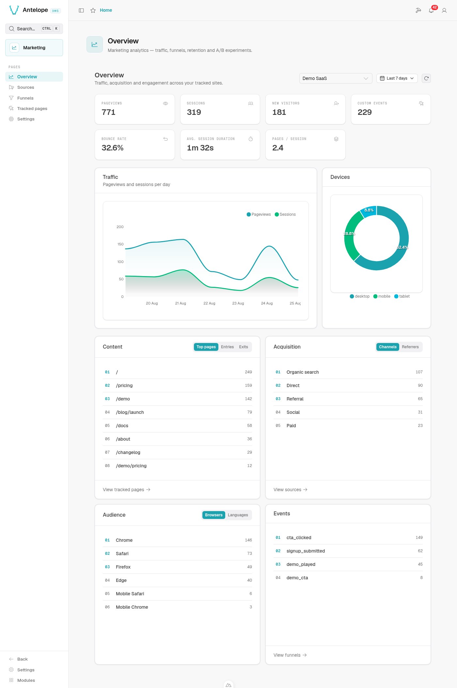

# Overview dashboard

**Where:** `/modules/marketing/overview` — the module's landing page.

The overview answers "how is the site doing" for one website over a chosen
period: traffic volume, where visitors come from, and what they use.

  

## What it shows

- **KPI row** — pageviews, sessions, new visitors and custom events for the
  period, plus three session-quality metrics derived from them: **bounce
  rate** (share of sessions that never passed one pageview), **average
  session duration** (observed activity span — last beacon minus first) and
  **pages per session**.
- **Traffic chart** — daily pageviews and sessions.
- **Device split** — desktop / mobile / tablet share.
- **Top lists** — four tabbed cards, each footer leading to the surface that
  owns the detail:
  - **Content** — top pages, **entry pages** (first page of each session)
    and **exit pages** (last page seen so far — it follows the session while
    it lives); every row deep-links to that page's heatmap on the
    [Tracked pages](heatmap.md) view.
  - **Acquisition** — **channels** (the direct / organic / social /
    referral / paid split) and **referrers**. UTM sources have no card here
    on purpose: the [Campaigns page](campaigns.md) table is their surface,
    one footer click away.
  - **Audience** — browsers and **languages** (as the visitors' browsers
    report them, shown as readable names). A **Countries** tab joins them
    when the deployment configures a GeoIP database (`geoipDatabasePath`,
    see [install.md](../install.md#declare-the-module)): the country is
    derived from the IP at collection and stored as a code — the IP itself
    never is.
  - **Events** — custom event names ranked by trigger count, the breakdown
    behind the custom-events KPI ([tracking.md](tracking.md)).

  Everything is ranked over the selected period, and the active tab of each
  card persists in the URL.

## Selectors

- **Website** — the list comes back most-recently-active first, so landing on
  the first entry lands on one with data.
- **Period** — presets up to 90 days. `MAX_QUERY_PERIOD_DAYS` (90) bounds every
  window; the default is 7 days.

## Where the numbers come from

Every panel reads the **daily rollups** (`marketing_website_statistics`),
never raw events — the dashboard stays fast regardless of traffic volume, and
keeps working after raw events expire. Two consequences worth knowing:

- **Top lists are capped.** A day keeps at most `MAX_ENTRIES_PER_TOP_MAP` (50)
  entries per list, and days older than 90 days keep only scalar counters
  (their top maps are emptied — no query can reach them anyway). Totals are
  exact; long-tail entries in top lists are not.
- **Referrers are acquisition sources, not navigation.** A referrer matching
  the website's `domain` — or any hostname the batch was tracked from — is
  dropped at ingestion, never counted as a source.
- **Counters added later start at their ship date.** Rollup days written
  before bounce, duration or the entry/exit and events dimensions existed
  read as zero for them; a window overlapping that boundary understates
  those metrics, never the traffic ones.

See [architecture.md](../architecture.md) for how the rollups are written.
