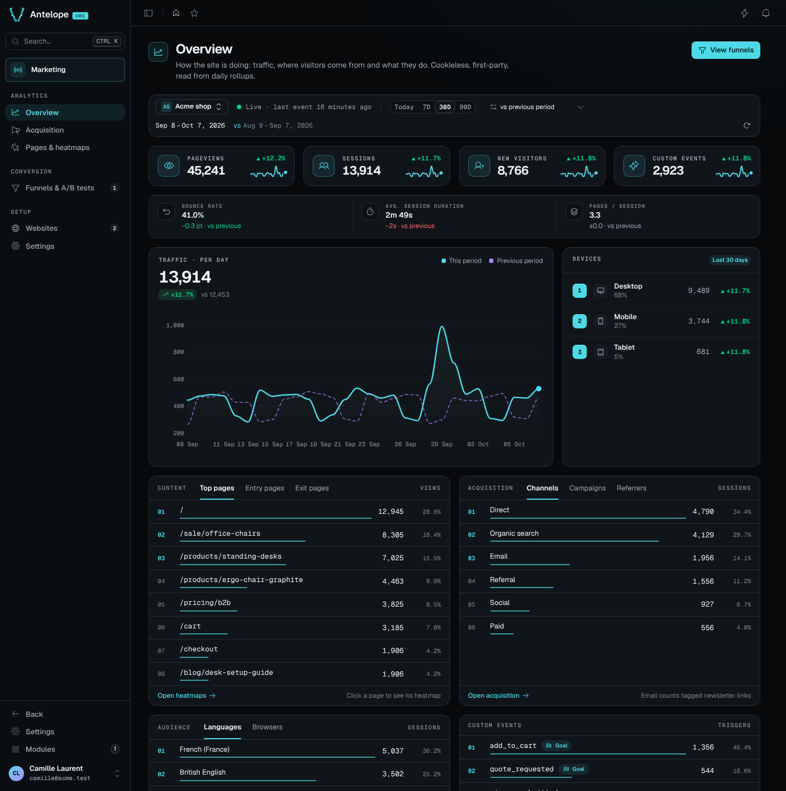

# Overview dashboard

**Where:** `/modules/marketing/overview` — the module's landing page, first
under the **Analytics** heading.

The overview answers "how is the site doing" for one website over a chosen
period: traffic volume, where visitors come from, and what they use.

  

## The context bar

Every analytics page (Overview, Acquisition, Pages & heatmaps, Funnels)
opens on the same bar, and every block of the page reads what it picks:

- **Website** — the switcher lists the workspace's sites with their state:
  *Live · last event …* once a pageview has arrived, *Waiting for the first
  event* before that, *Tracking paused for this website* when the site's own
  switch is off. The pick is stored server-side per member, so it follows
  you across pages and devices. Until you pick one, the most recently active
  site is shown.
- **Period** — Today, 7D, 30D or 90D; 30 days by default.
  `MAX_QUERY_PERIOD_DAYS` (90) bounds every window.
- **Comparison** — the previous period (default), the same period a year
  earlier, or none. The bar shows the resolved ranges of both.
- **Refresh** — refetches every block of the page.

The period and comparison persist in the browser (cookie
`dms-marketing-period`), so they survive navigation between the module's
pages. While the workspace has no website, a first-run screen with **Add a
website** replaces the page's blocks.

## What it shows

- **KPI cards** — pageviews, sessions, new visitors and custom events for
  the period, each with its change against the comparison window and a
  daily sparkline.
- **Session quality** — **bounce rate** (share of sessions that never passed
  one pageview; its change reads in points, and a decrease reads as the good
  direction), **average session duration** (observed activity span — last
  beacon minus first) and **pages per session**.
- **Traffic chart** — sessions per day, the comparison window drawn dashed
  behind the period.
- **Devices** — sessions by device type, with their share.
- **Top lists** — four tabbed cards, each footer leading to the surface that
  owns the detail:
  - **Content** — top pages, **entry pages** (first page of each session)
    and **exit pages** (last page seen so far — it follows the session while
    it lives); a click on a page opens its heatmap on
    [Pages & heatmaps](heatmap.md).
  - **Acquisition** — **channels** (the direct / organic / social / email /
    referral / paid split), **campaigns** and **referrers**; the footer opens
    the [Acquisition page](acquisition.md).
  - **Audience** — browsers and **languages** (as the visitors' browsers
    report them, shown as readable names). A **Countries** tab joins them
    when the deployment configures a GeoIP database (`geoipDatabasePath`,
    see [install.md](../install.md#declare-the-module)): the country is
    derived from the IP at collection and stored as a code — the IP itself
    never is.
  - **Custom events** — custom event names ranked by trigger count, the
    breakdown behind the custom-events KPI ([tracking.md](tracking.md)). An
    event that is the last step of a funnel of the site is tagged **Goal**;
    the footer opens the funnel builder.

  Everything is ranked over the selected period.

The header's **View funnels** action leads to
[Funnels & A/B tests](funnels.md).

## Where the numbers come from

Every panel reads the **daily rollups** (`marketing_website_statistics`),
never raw events — the dashboard stays fast regardless of traffic volume, and
keeps working after raw events expire. A few consequences worth knowing:

- **Periods are whole days, in UTC.** The bounds the context bar sends are
  mapped on the UTC days carrying the same dates, which is what rollup rows
  are keyed on.
- **Top lists are capped.** A day keeps at most `MAX_ENTRIES_PER_TOP_MAP` (50)
  entries per list, and days older than 90 days keep only scalar counters
  (their top maps are emptied — no query can reach them anyway). Totals are
  exact; long-tail entries in top lists are not.
- **Referrers are acquisition sources, not navigation.** A referrer matching
  the website's `domain` — or any hostname the batch was tracked from — is
  dropped at ingestion, never counted as a source.
- **Counters added later start at their ship date.** Rollup days written
  before bounce, duration or the entry/exit and events dimensions existed
  read as zero for them; a window overlapping that boundary understates
  those metrics, never the traffic ones.

See [architecture.md](../architecture.md) for how the rollups are written.
