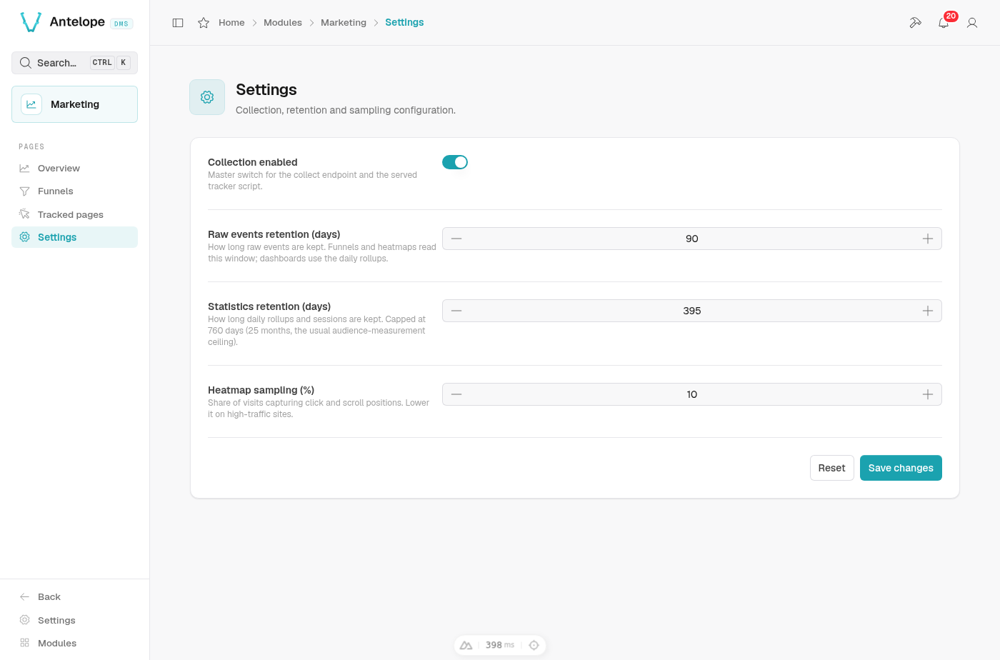

# Settings

**Where:** `/modules/marketing/settings`. Values apply without restart;
clearing a numeric field resets it to the deployment's config default.

The settings row is deployment-global (owner-only, like every module page):
it drives collection and retention for **all** tenants and websites.

  

## The fields

- **Collection switch** — the master switch. Off, the collect endpoint stops
  accepting events *and the tracker script itself is served as a 404*, so
  client sites stop sending at the source.
- **Raw events retention (days)** — how long raw events
  (`marketing_events`) are kept. Default 90 days. Raw events back the
  heatmaps and funnel computations; dashboards do not read them.
- **Statistics retention (days)** — how long the daily rollups are kept.
  Default 395 days (13 months), capped at 760 days (25 months — two full
  year-over-year windows, and the ceiling most privacy regimes put on
  audience-measurement data).
- **Heatmap sampling (%)** — the share of page loads that record clicks and
  scrolls. Default 10 %. `data-heatmap-sample` on a site's embed overrides it
  for that site.
- **Page snapshot retention (days)** — how long a captured page rendering is
  kept as a heatmap backdrop ([heatmap.md](heatmap.md#page-snapshots)).
  Default 30 days, and never longer than the raw events whatever is typed:
  snapshots hold page content, and a backdrop outliving every click it
  could back is content kept for nothing.

An hourly job prunes every store past its retention.

## Propagation delay

The served tracker embeds these settings, and the script response is cached
for one hour — so a sampling or switch change reaches returning visitors
within that window, not instantly. (The 404 for a disabled tracker obeys the
same cache.)
