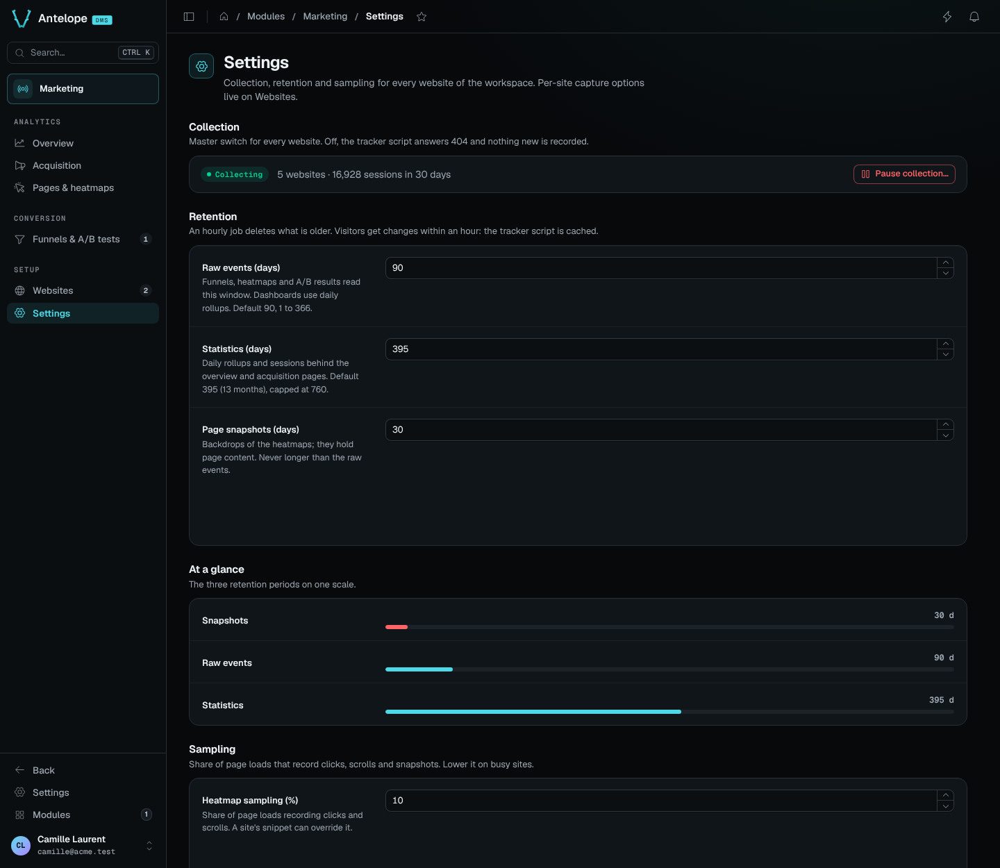

# Settings

**Where:** `/modules/marketing/settings` — under **Setup**. Values apply
without restart; clearing a numeric field resets it to the deployment's
config default.

The settings row is deployment-global (owner-only, like every module page):
it drives collection and retention for **all** tenants and websites.
Per-site capture options (page snapshots, text masking) live in each
website's drawer on the Websites page.

  

## Collection

The master switch, outside any form. The section states whether the module
is collecting, with the workspace's websites and their sessions over the
last 30 days. **Pause collection…** asks for confirmation and lists what it
does:

- the tracker script answers **404** on every site, and the collect endpoint
  stops accepting events, so client sites stop sending at the source;
- running A/B tests stop assigning variations — every visitor gets the
  control;
- browsers holding the cached script stop within an hour (see
  [Propagation delay](#propagation-delay)).

Nothing collected is deleted. **Resume collection** turns it back on. While
collection is paused, the module's tile in the DMS catalog shows an
attention status and reads *Collection is paused*.

## Retention

- **Raw events (days)** — how long raw events (`marketing_events`) are
  kept. Default 90 days, 1 to 366. Raw events back the heatmaps, funnels and
  A/B results; dashboards do not read them.
- **Statistics (days)** — how long the daily rollups and sessions are kept.
  Default 395 days (13 months), capped at 760 days (25 months — two full
  year-over-year windows, and the ceiling most privacy regimes put on
  audience-measurement data).
- **Page snapshots (days)** — how long a captured page rendering is kept as
  a heatmap backdrop ([heatmap.md](heatmap.md#page-snapshots)). Default 30
  days, and never longer than the raw events: a value above the raw-event
  retention is refused, not saved, since snapshots hold page content and a
  backdrop outliving every click it could back is content kept for nothing.

An hourly job prunes every store past its retention. **At a glance** draws
the three retention periods as meters on one scale.

## Sampling

- **Heatmap sampling (%)** — the share of page loads that record clicks and
  scrolls (and, on sites that enabled them, page snapshots). Default 10 %.
  `data-heatmap-sample` on a site's embed overrides it for that site.

## Saving

Each form saves its own fields: the settings route
(`POST /api/marketing/settings`) merges a partial body into the stored
values, so a field left out keeps its value and a field sent as `null` goes
back to the config default. A body that would leave snapshot retention above
raw-event retention is answered **400**, with nothing saved.

## Propagation delay

The served tracker embeds these settings, and the script response is cached
for one hour — so a sampling or switch change reaches returning visitors
within that window, not instantly. (The 404 for a paused tracker obeys the
same cache.)
